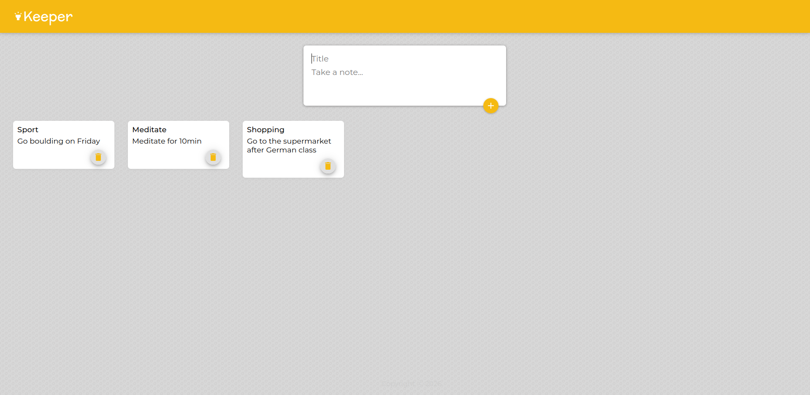

# Keeper App

A simple, fast note-taking web application built with React and Vite. Create, organize, and manage your notes with an intuitive user interface powered by Material-UI.

## Features 

- **Create Notes** - Quickly add new notes with title and content
- **Delete Notes** - Remove notes you no longer need with a single click
- **Responsive Design** - Beautiful Material-UI components that work seamlessly
- **Fast Performance** - Built with Vite for lightning-fast development and production builds

## Screenshot



## Tech Stack

- **React 19.2** - Modern JavaScript library for building user interfaces
- **Vite** - Next generation frontend build tool with lightning-fast HMR
- **Material-UI (MUI)** - Comprehensive React component library
- **Emotion** - CSS-in-JS library for styling
- **ESLint** - Code quality and consistency

## Getting Started

### Prerequisites

- Node.js (v14 or higher)
- npm or yarn package manager

### Installation

1. Clone the repository:
```bash
git clone https://github.com/yourusername/keeper-app.git
cd keeper-app
```

2. Install dependencies:
```bash
npm install
```

### Development

Start the development server with hot module replacement:
```bash
npm run dev
```

The application will be available at `http://localhost:5173`

### Build

Create a production-ready build:
```bash
npm run build
```

### Preview

Preview the production build locally:
```bash
npm run preview
```

### Linting

Check code quality:
```bash
npm run lint
```

## Project Structure

```
keeper-app/
├── src/
│   ├── App.jsx           # Main application component
│   ├── Header.jsx        # Header component
│   ├── CreateArea.jsx    # Form for creating new notes
│   ├── Note.jsx          # Individual note display component
│   ├── Footer.jsx        # Footer component
│   ├── App.css           # Application styles
│   ├── index.css         # Global styles
│   ├── main.jsx          # Entry point
│   └── assets/           # Static assets
├── public/
│   └── styles.css        # Public styles
├── package.json          # Project dependencies
├── vite.config.js        # Vite configuration
└── eslint.config.js      # ESLint configuration
```

## Usage

1. **Create a Note**: Fill in the title and content fields in the create area and click the add button
2. **View Notes**: Your notes appear below the create area
3. **Delete a Note**: Click the delete icon on any note to remove it

## License 

This project is open source and available under the MIT License.

---

